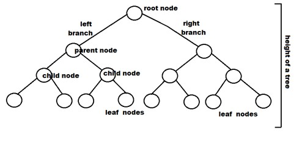

# Binary Trees
## Introduction
Binary trees are a fundamental data structure in computer science, where each node has at most two child nodes, typically referred to as the left child and the right child. They are widely used in various algorithms and applications, such as search, sorting, and file systems.

## What is a Binary Tree?
A binary tree is a tree-based data structure where each node has at most two child nodes, referred to as the left child and the right child. The topmost node in the tree is called the root, and the nodes without any child nodes are called leaf nodes.
## Advantages of Binary Trees

* Efficient searching and sorting
* Easy to implement
* Can be used to represent a variety of data structures
## Disadvantages of Binary Trees

* Can become unbalanced, which can affect performance
* Not as efficient as other data structures for some operations, such as insertion and deletion


## Difference between a Binary Tree and a Binary Search Tree
The main difference between a binary tree and a binary search tree (BST) is the way the nodes are organized. In a binary search tree, the value of each node is greater than or equal to the values in all the nodes in its left subtree, and less than the values in all the nodes in its right subtree. This property allows for efficient searching, insertion, and deletion operations in a BST.

## Possible Gain in Time Complexity Compared to Linked Lists
Compared to linked lists, binary trees can offer better time complexity for certain operations, such as search, insertion, and deletion. In a well-balanced binary tree, these operations can be performed in O(log n) time, whereas in a linked list, they have a time complexity of O(n).

## Depth, Height, and Size of a Binary Tree
- **Root**: The topmost node in the tree.
Parent: A node that has one or two child nodes.
- **Child**: A node that has a parent node.
- **Leaf**: A node that has no child nodes.
- **Degree**: The number of child nodes a node has.
- **Depth**: The depth of a node in a binary tree is the number of edges from the root to that node.
- **Height**: The height of a binary tree is the number of edges from the root to the furthest leaf node.
- **Size**: The size of a binary tree is the total number of nodes in the tree.

## Traversal Methods
There are three main traversal methods for binary trees:
1. **Preorder Traversal**: The root node is visited first, followed by the left subtree and then the right subtree.
2. **Inorder Traversal**: The left subtree is visited first, followed by the root node and then the right subtree.
3. **Postorder Traversal**: The left subtree is visited first, followed by the right subtree and then the root node.

## Types of Binary Trees
- **Complete Binary Tree**: A binary tree is said to be complete if all levels, except possibly the last, are completely filled, and all nodes are as far left as possible.
- **Full Binary Tree**: A binary tree is said to be full if every node has either 0 or 2 children.
- **Perfect Binary Tree**: A binary tree is said to be perfect if all internal nodes have two children, and all leaf nodes are at the same level.
- **Balanced Binary Tree**: A binary tree is said to be balanced if the difference between the heights of the left and right subtrees of any node is not more than 1.

## Applications of Binary Trees 
**Searching** : Binary search trees are used to efficiently search for data in a sorted collection.
**Sorting**: Binary trees can be used to sort data in ascending or descending order.
**Storing hierarchical data**: Binary trees are used to store hierarchical data, such as file systems and organizational charts.
**Implementing priority queues**: Binary heaps are used to implement priority queues, which allow elements to be inserted and removed based on their priority.


## Implementation

The binary tree data structure is defined as follows:

```c
/**
 * struct binary_tree_s - Binary tree node
 *
 * @n: Integer stored in the node
 * @parent: Pointer to the parent node
 * @left: Pointer to the left child node
 * @right: Pointer to the right child node
 */
typedef struct binary_tree_s
{
    int n;
    struct binary_tree_s *parent;
    struct binary_tree_s *left;
    struct binary_tree_s *right;
} binary_tree_t;
```

The `binary_tree_t` structure represents a node in the binary tree, with the following fields:
- `n`: The integer value stored in the node.
- `parent`: A pointer to the parent node.
- `left`: A pointer to the left child node.
- `right`: A pointer to the right child node.

## Functions

### 0. `binary_tree_node(binary_tree_t *parent, int value)`
This function creates a new binary tree node with the given value and parent.

### 1. `binary_tree_insert_left(binary_tree_t *parent, int value)`
This function inserts a new left child node with the given value to the parent node.

### 2. `binary_tree_insert_right(binary_tree_t *parent, int value)`
This function inserts a new right child node with the given value to the parent node.

### 3. `binary_tree_delete(binary_tree_t *tree)`
This function deletes the entire binary tree.

### 4. `binary_tree_is_leaf(const binary_tree_t *node)`
This function checks if a node is a leaf (has no children).

### 5. `binary_tree_is_root(const binary_tree_t *node)`
This function checks if a node is the root of the binary tree.

### 6. `binary_tree_preorder(const binary_tree_t *tree, void (*func)(int))`
This function performs a preorder traversal of the binary tree, calling the provided function for each node.

### 7. `binary_tree_inorder(const binary_tree_t *tree, void (*func)(int))`
This function performs an inorder traversal of the binary tree, calling the provided function for each node.

### 8. `binary_tree_postorder(const binary_tree_t *tree, void (*func)(int))`
This function performs a postorder traversal of the binary tree, calling the provided function for each node.

### 9. `binary_tree_height(const binary_tree_t *tree)`
This function calculates the height of the binary tree.

### 10. `binary_tree_depth(const binary_tree_t *tree)`
This function calculates the depth of a node in the binary tree.

### 11. `binary_tree_size(const binary_tree_t *tree)`
This function calculates the size (number of nodes) of the binary tree.

### 12. `binary_tree_leaves(const binary_tree_t *tree)`
This function counts the number of leaf nodes in the binary tree.

### 13. `binary_tree_nodes(const binary_tree_t *tree)`
This function counts the number of non-leaf nodes in the binary tree.

### 14. `binary_tree_balance(const binary_tree_t *tree)`
This function calculates the balance factor of a node in the binary tree.

### 15. `binary_tree_is_full(const binary_tree_t *tree)`
This function checks if the binary tree is full (every node has either 0 or 2 children).

### 16. `binary_tree_is_perfect(const binary_tree_t *tree)`
This function checks if the binary tree is perfect (all internal nodes have two children, and all leaf nodes are at the same level).

### 17. `binary_tree_sibling(binary_tree_t *node)`
This function finds the sibling of a given node.

### 18. `binary_tree_uncle(binary_tree_t *node)`
This function finds the uncle of a given node.

### 19. `binary_trees_ancestor(const binary_tree_t *first, const binary_tree_t *second)`
This function finds the lowest common ancestor of two nodes in the binary tree.

### 20. `binary_tree_levelorder(const binary_tree_t *tree, void (*func)(int))`
This function performs a level-order traversal of the binary tree, calling the provided function for each node.

### 21. `binary_tree_is_complete(const binary_tree_t *tree)`
This function checks if the binary tree is complete (all levels are filled, except possibly the last level).

### 22. `binary_tree_rotate_left(binary_tree_t *tree)`
This function performs a left rotation on the binary tree.

### 23. `binary_tree_rotate_right(binary_tree_t *tree)`
This function performs a right rotation on the binary tree.

These functions provide a comprehensive set of tools for working with binary trees, including creation, traversal, analysis, and transformation.
